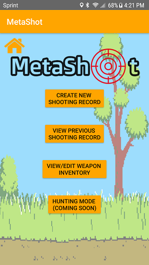
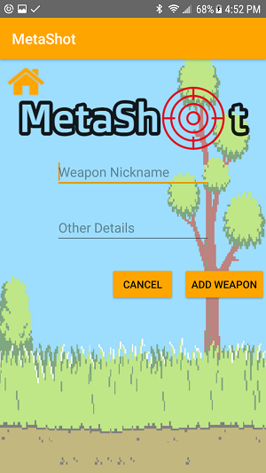

(Logo made with <a href="https://www.designevo.com/" title="Free Online Logo Maker">DesignEvo</a>)

## Hardware/Software Requirements
MetaShot is written for Android 8.0 (API level 26) with the minimum support of Android 7.0 (API level 24).

In order to utilize the "automatic recording of shots" functionality in the app, a MetaWear device is necessary. When purchasing a MetaWear device, ensure it contains, at minimum, the following sensors:
* Accelerometer 
* Temperature

MetaWear devices can be purchased from https://mbientlab.com/store/.

## Installation
To download the most recent release of MetaShot on your mobile device, navigate to this page on your mobile device and click on the provided download link [MetaShot APK](https://github.com/gandersonUNO/MetaShot/raw/master/misc/app-release.apk) or you can use scan the QR code provided to instantly down load the APK. For android to install unknown apps, be sure to opt-in for installing unknown sources, more information below. 

NOTE:
* Android protects users from inadvertent download and install of unknown apps, or apps from sources other than Google Play, which is trusted. Android blocks such installs until the user opts into allowing the installation of apps from other sources. The opt-in process depends on the version of Android running on the device:
* On devices running Android 8.0 (API level 26) and higher, you must navigate to the Install unknown apps system settings screen to enable app installations from a particular location.
* On devices running Android 7.1.1 (API level 25) and lower, users should enable the Unknown sources system setting, found in Settings > Security on the devices.
* When you attempt to install an unknown app on a device running Android 7.1.1 (API level 25) or lower, the system sometimes shows a dialog that asks whether you want to allow only one particular unknown app to be installed. In almost all cases, you should allow only one unknown app installation at a time if the option is available to you.
Note: Some network providers don’t allow users to install applications from unknown sources.

## Getting Started
In order to use MetaShot to its full potentaial, the following permissions and services are needed:
* Location permission granted
  * Permission requested in app
* Internet service enabled 
  * Either WiFi or cellular network
* GPS service enabled
* Bluetooth service enabled if using MetaWear device

### Landing Page

|  | <ul><li>Instruction 1</li><li>Instruction 2</li><li>Instruction n</li></ul> |
|:--:|:----------------------------------------------------:|

### Create New Shooting Record
|  | <ul><li>Instruction 1</li><li>Instruction 2</li><li>Instruction n</li></ul> |
|:--:|:----------------------------------------------------:|

### Create New Shot Records
|  | <ul><li>Instruction 1</li><li>Instruction 2</li><li>Instruction n</li></ul> |
|:--:|:----------------------------------------------------:|

### Manually Create Shot Records
|  | <ul><li>Instruction 1</li><li>Instruction 2</li><li>Instruction n</li></ul> |
|:--:|:----------------------------------------------------:|

### Automatically Generate Shot Records
|  | <ul><li>Every Metawear device has its own MAC Address. To find your devices MAC address, we recommend getting the MetaBase app from the play store, this will give you all the information you'll need regarding your Metawear device.</li><li>Once your Metawear device is connected, the start and stop buttons will become active to begin recording your shots.</li><li></li></ul> |
|:-----------:|:----------------------------------------------------:|
|  | <ul><li>Pressing start will begin recording shots from your Metawear device.</li><li>Upon a successful shot, a list will be populated where you can edit by selecting a record or delete a shot by press and holding a record.</li><li>To stop recording shots, you can press the Stop button.</li></ul> |

### View Previous Shooting Records
|  | <ul><li>Instruction 1</li><li>Instruction 2</li><li>Instruction n</li></ul> |
|:--:|:----------------------------------------------------:|

### View Single Previous Shooting Record
|  | <ul><li>Instruction 1</li><li>Instruction 2</li><li>Instruction n</li></ul> |
|:--:|:----------------------------------------------------:|

### View/Edit Weapon Inventory
|  | <ul><li>Instruction 1</li><li>Instruction 2</li><li>Instruction n</li></ul> |
|:--:|:----------------------------------------------------:|
|  | <ul><li>Instruction 1</li><li>Instruction 2</li><li>Instruction n</li></ul> |
